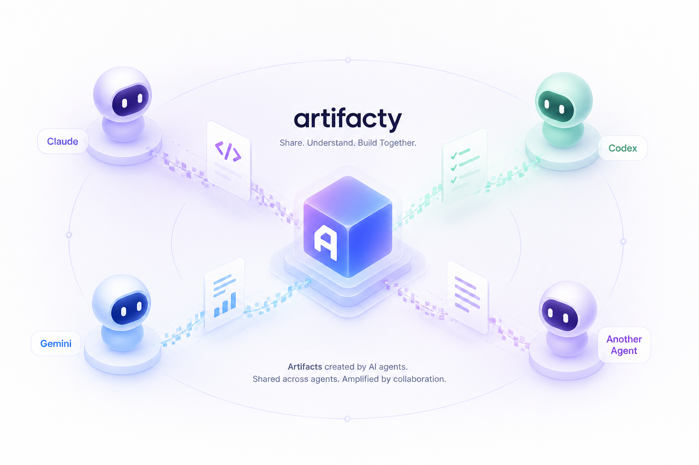

# Artifacty

[](https://github.com/raeseoklee/artifacty/actions/workflows/publish.yml)
[](https://www.npmjs.com/package/artifacty)
[](LICENSE)
[](package.json)

Artifacty is a local, agent-to-agent artifact exchange for LLM workflows. Claude, Codex, Gemini, and other MCP-capable tools can publish an artifact once, then other agents can list, read, update, and continue from it without copying content through chat.



## Why MCP

Claude Code artifacts are useful because they turn session output into shareable, versioned pages. Artifacty keeps that local and cross-agent: the browser server renders artifacts for people, while the MCP stdio server gives agents a common tool interface.

## Installation

Artifacty requires Node.js 22.5 or newer.

Install the CLI globally from npm:

```bash
npm install -g artifacty
artifacty --help
```

Run it without a global install:

```bash
npx artifacty@latest serve
```

Start the local dashboard:

```bash
artifacty serve
```

Open the URL printed by the server. Artifacty prefers `http://127.0.0.1:8787`; if that default port is busy and no explicit port was configured, it starts on the next available local port and records the actual URL for CLI and MCP responses.

Run it in the background and return to your prompt:

```bash
artifacty start
artifacty status
artifacty stop
```

`artifacty serve --detach` is equivalent to `artifacty start`. Logs are written under `~/.artifacty/logs/`.

Generate an API token at startup when you want to protect HTTP API and browser write routes:

```bash
artifacty serve --generate-token
artifacty serve --host 0.0.0.0 --share-mode lan --generate-token
npm start -- --generate-token
```

The server prints the generated token plus `/new?token=...` and `/import?token=...` URLs. For scripts or background services that need a stable token, generate one first:

```bash
artifacty token
artifacty start --api-token "$(artifacty token --raw)"
```

Install MCP configuration for local agents:

```bash
artifacty install claude
artifacty install codex --dry-run
artifacty install gemini
artifacty install all
artifacty check
```

Use `artifacty install codex --timeout 30000` or
`artifacty install gemini --timeout 30000` to tune supported MCP client timeouts.

See [docs/integrations.md](docs/integrations.md) for Claude Code, Codex, and Gemini CLI setup.

## Quick Start

Create an artifact in the browser:

```text
http://127.0.0.1:8787/new
```

For local development from a checkout:

```bash
npm install
npm test
npm start
```

Run the production-readiness check:

```bash
npm run release:check
```

Publish from the CLI:

```bash
artifacty publish --title "handoff note" --format markdown --source codex --content "# Next step\nReview the API plan."
```

Import an artifact produced by another agent and convert it to Artifacty format:

```bash
artifacty import --agent claude --file ./deploy-failures.html --tag review
artifacty import --agent gemini --content '{"title":"Plan","returnDisplay":"# Plan\n- Ship it"}'
artifacty import --agent codex --content '{"agent":"codex","title":"Implementation Handoff","goal":"Continue Phase 3","changedFiles":[{"path":"src/lib/render.js","status":"modified"}],"nextSteps":["Add CodeMirror read-only viewer"]}'
```

Codex structured payloads can become `handoff`, `bundle`, `diff-walkthrough`,
`code-review`, or `test-report` artifacts when the payload explicitly identifies
Codex through `agent` or `sourceAgent`. Plain Codex Markdown stays a normal
`document` unless you pass an explicit `artifactType`.

## Agent Handoff Example

One agent can publish a continuation artifact, then another agent can discover it, read the context, and append the next version.

Codex publishes the handoff:

```bash
artifacty import --agent codex --tag handoff --content '{
  "agent": "codex",
  "title": "Release Handoff",
  "goal": "Prepare Artifacty for an npm release",
  "changedFiles": [
    { "path": "src/lib/converters.js", "status": "modified", "summary": "Normalize agent outputs" }
  ],
  "commands": [
    { "command": "npm run release:check", "status": "passed" }
  ],
  "nextSteps": [
    "Review README",
    "Publish package"
  ]
}'
```

Claude or Gemini finds the handoff and continues from the same artifact:

```bash
artifacty list --tag handoff
artifacty show release-handoff-abc12345 --raw
artifacty update release-handoff-abc12345 \
  --format markdown \
  --source claude \
  --tag handoff \
  --content "# Release Handoff\n\nReviewed README and prepared publish notes."
```

List artifacts:

```bash
artifacty list
```

Run the MCP server:

```bash
artifacty-mcp
```

MCP clients can create artifacts with `artifacty_create`. `artifacty_publish` remains as a backwards-compatible alias.

Operational commands:

```bash
artifacty audit --limit 20
artifacty backup
artifacty export --file ./artifacty-backup.json
artifacty import-store --file ./artifacty-backup.json
artifacty start
artifacty status
artifacty stop
artifacty service install --dry-run
```

When working from a source checkout without global installation, replace `artifacty` with `node src/cli.js` and `artifacty-mcp` with `node src/mcp-server.js`.

## Storage

By default Artifacty stores files under `~/.artifacty`.

```bash
ARTIFACTY_HOME=/path/to/shared/store artifacty serve
```

Artifact metadata is stored in `artifacty.sqlite`; artifact content is stored as immutable version files under `artifacts/`. The current browser server URL is written to `server.json` so MCP tools can return the correct links when the default port falls back. Existing `index.json` stores are migrated automatically on first access.

## API Example

Start a protected server in another terminal, or generate a reusable shell token first:

```bash
artifacty serve --generate-token
export ARTIFACTY_API_TOKEN="$(artifacty token --raw)"
```

```bash
curl -s http://127.0.0.1:8787/api/artifacts \
  -H 'content-type: application/json' \
  -H "x-artifacty-token: $ARTIFACTY_API_TOKEN" \
  -d '{
    "title": "PR review dashboard",
    "content": "<h1>Review</h1>",
    "format": "html",
    "sourceAgent": "claude",
    "tags": ["review"]
  }'
```

Convert-and-save an external agent artifact:

```bash
curl -s http://127.0.0.1:8787/api/import \
  -H 'content-type: application/json' \
  -H "x-artifacty-token: $ARTIFACTY_API_TOKEN" \
  -d '{
    "agent": "claude",
    "fileName": "deploy-failures.html",
    "content": "<html><head><title>Deploy failures</title></head><body>...</body></html>",
    "tags": ["review"]
  }'
```

Browser routes:

- `/`: list artifacts with search, tag, and source filters.
- `/new`: create an Artifacty-native artifact with the CodeMirror editor.
- `/import`: paste an external agent artifact and convert it with automatic editor mode detection.
- `/artifacts/:id/edit`: save a new version with Markdown, HTML, JSON, text, code, SVG, Mermaid, or React syntax support.
- `/artifacts/:id/diff`: compare versions.
- `/api/audit`: list audit events.

## Interface Language

The browser UI defaults to English. Add `?lang=ko` to any browser route to use Korean, for example `http://127.0.0.1:8787/new?lang=ko`. Forms and in-app links preserve the selected language. Documentation is maintained in English only.

Schema and storage:

- Metadata lives in SQLite with `schemaVersion: 1`, `artifactType`, and `archivedAt`.
- Archive hides artifacts from default lists without deleting versions.
- Bundle artifacts store multiple files or base64 assets as portable JSON.
- Supported formats are `html`, `markdown`, `text`, `json`, `code`, `svg`, `mermaid`, and `react`.
- Diagram, component, and source snippet artifacts use `diagram`, `component`, and `snippet` artifact types.
- See [docs/artifact-schema-v1.md](docs/artifact-schema-v1.md).
- See [docs/sarif-csv-artifact-plan.md](docs/sarif-csv-artifact-plan.md) for the SARIF/CSV output artifact roadmap.

## Security Model

- The HTTP server binds to `127.0.0.1` by default.
- If `ARTIFACTY_API_TOKEN` is set, HTTP API routes require `Authorization: Bearer <token>` or `x-artifacty-token`.
- Binding outside localhost requires both `ARTIFACTY_SHARE_MODE=lan` or `team` and `ARTIFACTY_API_TOKEN`.
- Non-local sharing is intended for trusted LAN or VPN sessions. Prefer a specific interface IP over `0.0.0.0`, keep React rendering disabled, and see [docs/network-sharing.md](docs/network-sharing.md).
- Artifact content is scanned for common API keys and private keys before storage. Use `--allow-secrets` or `ARTIFACTY_ALLOW_SECRETS=true` only for intentional exceptions.
- Creates, updates, reads, imports, archives, and restores write audit events to SQLite.
- CodeMirror editor/viewer and renderer assets are served from local npm dependencies through a package allowlist, not from a public CDN. JavaScript asset routes answer `Origin: null` requests with `Access-Control-Allow-Origin: null` so sandboxed renderer iframes can import local ESM without `allow-same-origin`.
- Mutating HTTP routes reject non-local browser origins.
- HTML artifacts render in a sandboxed iframe.
- SVG artifacts render in a scriptless sandboxed iframe and are sanitized for `<script>`, `on*` attributes, and `javascript:` links in the viewer. The raw source remains unchanged.
- Mermaid artifacts render with the vendored local Mermaid package in a sandboxed iframe without `allow-same-origin`.
- React artifacts are source-only by default. Set `ARTIFACTY_ENABLE_REACT_RENDERER=true` to execute them in a sandboxed frame with a frame-scoped CSP that permits JSX transformation.
- Artifact content should still be treated as untrusted; use the raw view when handing content back to an agent.

See [docs/release-checklist.md](docs/release-checklist.md) before publishing or running a shared instance.
