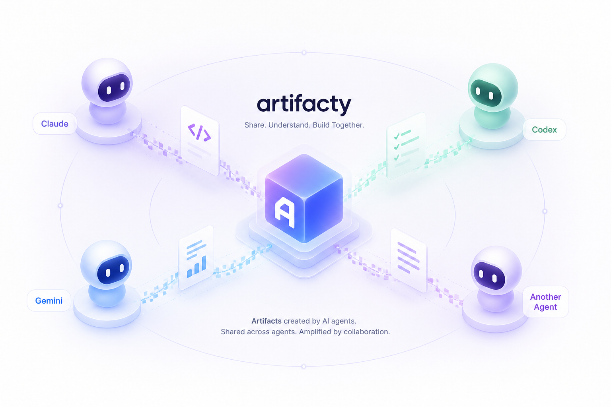

# Artifacty

[](https://github.com/raeseoklee/artifacty/actions/workflows/publish.yml)
[](https://www.npmjs.com/package/artifacty)
[](LICENSE)
[](package.json)

Artifacty is a local, agent-to-agent artifact exchange for LLM workflows. Claude, Codex, Gemini, GitHub Copilot, Cursor, and other MCP-capable tools can publish an artifact once, then other agents can list, read, update, and continue from it without copying content through chat.



## Why MCP

Claude Code artifacts are useful because they turn session output into shareable, versioned pages. Artifacty keeps that local and cross-agent: the browser server renders artifacts for people, while the MCP stdio server gives agents a common tool interface.

## Installation

Artifacty requires Node.js 22.5 or newer.

Install the CLI globally from npm:

```bash
npm install -g artifacty
artifacty --help
```

Run it without a global install:

```bash
npx artifacty@latest serve --foreground
```

Start the local dashboard in the background:

```bash
artifacty serve
```

Open the `url` printed in the JSON response. Artifacty prefers `http://127.0.0.1:8787`; if that default port is busy and no explicit port was configured, it starts on the next available local port and records the actual URL for CLI and MCP responses.

Manage the background server:

```bash
artifacty status
artifacty stop
```

`artifacty start` and `artifacty serve --detach` use the same lifecycle path as `artifacty serve`. Logs are written under `~/.artifacty/logs/`.
These lifecycle commands use Node's detached process support and work on macOS, Linux, and Windows. `artifacty stop` uses process-group signals on macOS/Linux and Windows `taskkill`, falling back to `/F` when Windows requires forceful termination.

For foreground debugging, keep the process attached:

```bash
artifacty serve --foreground
npm start
```

Generate an API token at startup when you want to protect HTTP API and browser write routes:

```bash
artifacty serve --generate-token
artifacty serve --host 0.0.0.0 --share-mode lan --generate-token
artifacty serve --foreground --generate-token
```

Background `serve` returns the generated token and ready-to-open `/new?token=...` and `/import?token=...` URLs in JSON. Foreground `serve` prints the same values to stderr. For scripts or long-running services that need a stable token, generate one first:

```bash
artifacty token
artifacty start --api-token "$(artifacty token --raw)"
```

Install MCP configuration for local agents:

```bash
artifacty install claude
artifacty install codex --dry-run
artifacty install gemini
artifacty install copilot
artifacty install cursor
artifacty install all
artifacty check
```

For a central internal server, enable the HTTP MCP endpoint on the server and
let users issue personal MCP/API tokens from the account page:

```bash
ARTIFACTY_BOOTSTRAP_TOKEN="$(artifacty token --raw)"
artifacty serve --host 10.0.0.50 --share-mode team --api-token "$ARTIFACTY_BOOTSTRAP_TOKEN" --mcp-http --foreground
# Open http://10.0.0.50:8787/login, create the first admin, then create a personal token at /account.
artifacty install all --mcp-url http://10.0.0.50:8787/mcp --api-token "$ARTIFACTY_PERSONAL_TOKEN"
```

When running the central server as a Linux `systemctl --user` service, enable
lingering for the service account so Artifacty stays up after logout:
`sudo loginctl enable-linger $USER`.

Administrators can create users individually at `/admin/users` or import them
from CSV. Use `email,name,role,password,password_reset_required` headers. If
`password` is empty, Artifacty generates a temporary password, shows it once in
the import result, and requires the user to change it on first sign-in.

```csv
email,name,role
user@example.com,User,user
admin2@example.com,Admin Two,admin
```

```bash
artifacty users import --file users.csv
```

Run diagnostics for the local runtime, store, server, service definitions, and MCP discovery:

```bash
artifacty doctor
artifacty doctor --skip-mcp
```

Use `artifacty install codex --timeout 30000` or
`artifacty install gemini --timeout 30000` to tune supported MCP client timeouts.

See [docs/integrations.md](docs/integrations.md) for Claude Code, Codex, Gemini CLI, GitHub Copilot in VS Code, and Cursor setup.

## Quick Start

Create an artifact in the browser:

```text
http://127.0.0.1:8787/new
```

For local development from a checkout:

```bash
npm install
npm test
npm start
```

Run the production-readiness check:

```bash
npm run release:check
```

Publish from the CLI:

```bash
artifacty publish --title "handoff note" --format markdown --source codex --content "# Next step\nReview the API plan."
```

Import an artifact produced by another agent and convert it to Artifacty format:

```bash
artifacty import --agent claude --file ./deploy-failures.html --tag review
artifacty import --agent gemini --content '{"title":"Plan","returnDisplay":"# Plan\n- Ship it"}'
artifacty import --agent codex --content '{"agent":"codex","title":"Implementation Handoff","goal":"Continue Phase 3","changedFiles":[{"path":"src/lib/render.js","status":"modified"}],"nextSteps":["Add CodeMirror read-only viewer"]}'
artifacty import --agent copilot --content '{"agent":"github-copilot","title":"PR Review","findings":[{"severity":"medium","file":"src/app.js","line":42,"title":"Handle missing state"}]}'
artifacty import --agent cursor --content '{"sourceAgent":"cursor","title":"Cursor Handoff","summary":"Editor pass complete.","nextSteps":["Run visual QA."]}'
```

Codex, GitHub Copilot, and Cursor structured payloads can become `handoff`,
`bundle`, `diff-walkthrough`, `code-review`, or `test-report` artifacts when
the payload explicitly identifies the agent through `agent` or `sourceAgent`.
Plain Markdown from these agents stays a normal
`document` unless you pass an explicit `artifactType`.

When `format` is omitted, Artifacty infers common formats from filename,
content type, and content. HTML files and HTML fragments such as
`<section>...</section>` are stored as `html` so the browser viewer renders
them as HTML instead of plain text.

## Agent Handoff Example

One agent can publish a continuation artifact, then another agent can discover it, read the context, and append the next version.

Codex publishes the handoff:

```bash
artifacty import --agent codex --tag handoff --content '{
  "agent": "codex",
  "title": "Release Handoff",
  "goal": "Prepare Artifacty for an npm release",
  "changedFiles": [
    { "path": "src/lib/converters.js", "status": "modified", "summary": "Normalize agent outputs" }
  ],
  "commands": [
    { "command": "npm run release:check", "status": "passed" }
  ],
  "nextSteps": [
    "Review README",
    "Publish package"
  ]
}'
```

Claude or Gemini finds the handoff and continues from the same artifact:

```bash
artifacty list --tag handoff
artifacty show release-handoff-abc12345 --raw
artifacty update release-handoff-abc12345 \
  --format markdown \
  --source claude \
  --tag handoff \
  --content "# Release Handoff\n\nReviewed README and prepared publish notes."
```

List artifacts:

```bash
artifacty list
artifacty list --query review --limit 20 --offset 20
```

Run the MCP server:

```bash
artifacty-mcp
ARTIFACTY_MCP_MODE=bridge ARTIFACTY_MCP_URL=http://10.0.0.50:8787/mcp ARTIFACTY_API_TOKEN=... artifacty-mcp
```

MCP clients can create artifacts with `artifacty_create`. `artifacty_publish` remains as a backwards-compatible alias.
MCP clients that support resources or prompts can also read `artifacty://recent`,
`artifacty://artifacts/{id}`, `artifacty://artifacts/{id}/raw{?version}`, and
`artifacty://schema/v1`, or use prompt templates such as `artifacty_handoff`,
`artifacty_review`, and `artifacty_release_notes`.

Operational commands:

```bash
artifacty audit --limit 20
artifacty doctor
artifacty index rebuild
artifacty integrity
artifacty backup
artifacty backup --full
artifacty export --file ./artifacty-backup.json
artifacty export --file ./artifacty-backup-full.json --full
artifacty import-store --file ./artifacty-backup.json
artifacty import-store --file ./artifacty-backup-full.json --confirm replace-all [--force-users]
artifacty start
artifacty status
artifacty stop
artifacty service install --dry-run
artifacty service unit --dry-run
artifacty service task --dry-run
```

When working from a source checkout without global installation, replace `artifacty` with `node src/cli.js` and `artifacty-mcp` with `node src/mcp-server.js`.

## Storage

By default Artifacty stores files under `~/.artifacty`.

```bash
ARTIFACTY_HOME=/path/to/shared/store artifacty serve
```

Artifact metadata is stored in `artifacty.sqlite`; artifact content is stored as append-only version files under `artifacts/` for normal create and update flows. Administrators can repair or delete individual bad versions from the browser, and those exceptional actions are recorded in the audit log. The current browser server URL is written to `server.json` so MCP tools can return the correct links when the default port falls back. Existing `index.json` stores are migrated automatically on first access.

Every artifact row carries a `visibility` (`private`/`team`, default `team`) and an `ownerUserId`, backfilled from the artifact's `publisherUserId` on migration. See the Security Model section below for the access rules these enforce.

Administrators can download and restore backups from `/admin/backup`. The
default `artifacts` scope contains artifact metadata and version contents,
but not users, sessions, API token records, or audit logs. Restoring an
artifacts-scope bundle replaces the target server's artifact records and
prunes unreferenced version files, leaving users, tokens, and audit history
untouched.

A `full`-scope backup (`artifacty backup --full`, `?scope=full` on the
download, or the scope selector on `/admin/backup`) additionally includes
users (with password hashes), API tokens (hashed, never the raw token),
audit log entries, artifact relations, and webhooks. Webhook secrets are
never exported — restored webhooks come back disabled and must have their
secret re-issued. Sessions are never exported. Restoring a `full` bundle
requires explicit confirmation (`confirm: "replace-all"` over the API,
`--confirm replace-all` on the CLI, or the confirm checkbox in the browser)
and refuses to run when the target store already has users unless
`forceUsers`/`--force-users` is also set, since that would silently merge or
overwrite existing accounts. Restoring a bundle written before this feature
(no `bundleVersion`/`scope` header) is still supported and is always treated
as artifacts-only. For large migrations or scripted server moves, use
`artifacty backup --full` and
`artifacty import-store --file ./artifacty-backup.json --confirm replace-all`.

Search uses a SQLite FTS5 index when the local Node SQLite build supports it. The index covers the latest version body plus title, tags, source agent, artifact type, format, and metadata summary. If FTS5 is unavailable, Artifacty keeps working with metadata search. Rebuild or check the store when needed:

```bash
artifacty index rebuild
artifacty integrity
```

### Semantic Search

`?mode=keyword|semantic|hybrid` on `GET /api/artifacts`, the dashboard, `artifacty list --mode`, and the MCP `artifacty_list` tool add optional natural-language search on top of FTS5, without any bundled model or mandatory dependency:

- `keyword` is the existing FTS5/metadata path.
- `semantic` embeds the query and ranks artifacts by cosine similarity over stored vectors.
- `hybrid` (the default once a provider is configured and `q`/`query` is set) merges keyword and semantic rankings with reciprocal rank fusion.

Without an embedding provider configured, `semantic`/`hybrid` requests fall back to `keyword` and the response's `search.fallback` is `true`. Configure one provider through the environment:

```bash
# openai-compatible: POSTs { model, input } to <url>/embeddings
export ARTIFACTY_EMBEDDINGS_URL=https://api.openai.com/v1
export ARTIFACTY_EMBEDDINGS_MODEL=text-embedding-3-small
export ARTIFACTY_EMBEDDINGS_API_KEY=sk-...

# or: command, a local executable reading/writing JSON lines on stdin/stdout
# (wire in Ollama or any local model without an Artifacty dependency)
export ARTIFACTY_EMBEDDINGS_COMMAND="python3 embed.py"
```

The API key is read from the environment only; it is never logged, returned in an error, or persisted to the store (`artifacty doctor` reports the provider and model with the key redacted). New artifacts are embedded automatically in the background after create/update, and existing ones can be (re-)embedded in batches of 16 with:

```bash
artifacty index rebuild --embeddings
```

### Relations

Artifacts can be linked with typed, directional relations so a handoff, its review, and follow-up work stay discoverable from one another:

- Relation names are a closed set for v1: `derived-from`, `supersedes`, `reviews`, `references`, `part-of`.
- Every relation has a computed inverse (`derived-from` ↔ `derives`, `supersedes` ↔ `superseded-by`, `reviews` ↔ `reviewed-by`, `references` ↔ `referenced-by`, `part-of` ↔ `contains`) shown automatically on the other side.
- `POST`/`GET`/`DELETE /api/artifacts/:id/relations` manage links over HTTP; `GET /api/artifacts` accepts `relatedTo` and `relation` filters.
- `artifacty_create` and `artifacty_update` accept a `relations` array so an agent can link an artifact the moment it is published; `artifacty_get` responses include `relations: { outgoing, incoming }`.
- A relation whose target was deleted is reported with `missing: true` instead of being silently dropped.

```bash
artifacty link <from-id> derived-from <to-id>
artifacty relations <artifact-id>
artifacty show <artifact-id> --relations
artifacty unlink <from-id> derived-from <to-id>
```

### Comments and review status

Lightweight, version-anchored feedback without publishing a whole new version or a separate review artifact:

- Comments are Markdown, rendered through the same sanitized Markdown pipeline as artifact content, and capped at 16 KB. `anchor` is an optional, format-specific rendering hint — `{ line: 42 }` for text formats, `{ path: "$.runs[0].results[3]" }` for JSON/SARIF, `{ row: 7 }` for CSV — and is not validated against the artifact's actual content.
- Threads are one level deep: `parentId` on a new comment must point to a root comment (one with no `parentId` of its own).
- Deleting a comment is a soft delete: it disappears from `artifacty comments`/`GET .../comments` but its audit-log entry is kept. Pass `--include-deleted`/`includeDeleted=true` to see it anyway.
- Every artifact carries a `reviewStatus`: `none`, `pending`, `changes-requested`, or `approved`, set explicitly and reset to `pending` automatically (noted in that update's audit metadata) whenever a new version is appended after an `approved` status.
- `GET`/`POST /api/artifacts/:id/comments`, `POST /api/artifacts/:id/comments/:commentId/resolve`, `DELETE /api/artifacts/:id/comments/:commentId`, and `POST /api/artifacts/:id/review-status` manage comments and review status over HTTP.
- `artifacty_comment`, `artifacty_resolve_comment`, and `artifacty_set_review_status` are the MCP equivalents; `artifacty_get` accepts `includeComments: true` to return the requested version's open comments alongside the artifact.
- The browser artifact page shows a comments panel grouped by version, with a reply form, a resolve button, and (for the artifact's owner or an admin) a review-status selector. Line-anchored comments are shown as plain text (e.g. "line 42") rather than a CodeMirror gutter marker.

```bash
artifacty comment release-handoff-abc12345 --body "Looks good, one nit" --line 42
artifacty comments release-handoff-abc12345
artifacty resolve-comment release-handoff-abc12345 <comment-id>
artifacty review-status release-handoff-abc12345 approved
```

### Diff

`artifacty diff <id> [--from N] [--to M] [--structured] [--json]` compares two versions of an artifact, defaulting `--to` to the latest version and `--from` to `--to - 1`. JSON, SARIF, CSV, notebook, and bundle artifacts get a structured diff (JSON path entries, CSV row/cell entries, or per-file bundle entries) by default; other formats print a line diff. `--structured` forces the structured (word-highlighted line) diff for any format; `--json` prints the machine-readable form instead of the human-readable unified text.

```bash
artifacty diff release-handoff-abc12345
artifacty diff release-handoff-abc12345 --from 1 --to 3 --json
```

### Retention

Artifacts, audit rows, and events grow without bound by default. A declarative retention policy, stored in the `meta` table and edited through `/admin/retention` or `artifacty retention set`, lets an admin bound that growth:

- `archiveAfterDays` (a default plus optional per-artifact-type overrides) auto-archives artifacts that have not been updated within the window, unless the artifact carries a tag in `keepTags` or has `reviewStatus: "approved"`.
- `purgeArchivedAfterDays` hard-deletes artifacts that have been archived longer than the window, including their version files, dependent rows that cascade via foreign keys (comments, relations, embeddings), and their `events`/search-index rows. Audit log rows for the artifact are deliberately kept (see `auditRetentionDays` below) as the historical record that the purge happened, even though the artifact itself is gone. This is the only retention action that deletes data outright, so it is refused unless the operator has set `ARTIFACTY_RETENTION_ALLOW_PURGE=true` in the server environment; `--allow-purge` (or the `allowPurge` request field) only opts a single run in and never sets that environment variable itself. Always dry-run first (`artifacty retention run --dry-run`, or the report on `/admin/retention`) to review what would be purged.
- `auditRetentionDays` prunes old audit log rows, except `version-repair`, `version-delete`, `retention-purge`, `retention-policy-update`, and `owner-change`, which are kept indefinitely.
- `eventRetentionRows` caps how many rows the `events` change-notification table keeps.

A background sweep runs every `ARTIFACTY_RETENTION_INTERVAL_MS` (default one hour) alongside the HTTP server, checking the current policy on every tick — it starts even when the policy is all-unset, so setting a policy later takes effect on the next tick without a restart. `artifacty integrity`/`checkStoreIntegrity` flags any files left behind if a purge is ever interrupted, and `artifacty doctor` reports the current retention policy summary.

```bash
artifacty retention show
artifacty retention set --archive-after-days 90 --archive-after-days-for test-report=30 --purge-archived-after-days 180 --audit-retention-days 365 --event-retention-rows 10000 --keep-tag pinned
artifacty retention run --dry-run
ARTIFACTY_RETENTION_ALLOW_PURGE=true artifacty retention run --allow-purge
```

### Dashboard Filters and Saved Views

`listArtifactsPage` (and every surface built on it — the `/` dashboard, `GET /api/artifacts`, `artifacty list`, and `artifacty_list`) accepts these filters in addition to `q`/`tag`/`sourceAgent`/`relatedTo`/`relation`/`includeArchived`:

- `artifactType` — exact match against the artifact's type.
- `publisher` — matches `publisherId`, `publisherUserId`, or `ownerUserId`.
- `createdAfter` / `createdBefore` — ISO date or date-time bounds on `createdAt`. An unparseable value returns a `400` with `code: "invalid_filter"`.
- `reviewStatus` — the artifact-level review status: `none`, `pending`, `changes-requested`, or `approved`.

A frequently used filter combination can be saved as a **view**:

- `POST /api/views` with `{ name, filters, shared }` creates one; `GET /api/views` lists views visible to the caller; `DELETE /api/views/:id` removes one. `filters` is validated against an allowlist (`query`, `tag`, `sourceAgent`, `artifactType`, `publisher`, `createdAfter`, `createdBefore`, `reviewStatus`, `relatedTo`, `relation`, `includeArchived`, `mode`) and rejects any other key with `code: "invalid_filter"`.
- In single-user mode (no user accounts) views are global. In team mode a view belongs to its creator and is visible only to them unless `shared: true`, in which case every user sees it.
- `?view=<name-or-id>` on `/` or `GET /api/artifacts` expands the saved filters first; any other query parameter passed alongside `view` overrides that one filter. `artifacty_list` and `artifacty list --view <name-or-id>` work the same way.
- The dashboard sidebar lists views with delete buttons and a "Save current filters" form. `artifacty views`, `artifacty views save <name> [--shared] [filters...]`, and `artifacty views delete <id>` manage them from the CLI.
- `groupBy=artifactType|sourceAgent|day` (dashboard query param, `--group-by` on the CLI) renders the already-fetched page grouped under section headers. It is purely presentational and does not change which artifacts are fetched or their sort order.

```bash
artifacty list --type handoff --review-status pending --created-after 2025-01-01
artifacty views save open-handoffs --type handoff --review-status pending --shared
artifacty list --view open-handoffs --group-by sourceAgent
artifacty views delete <view-id>
```

## Events

Every mutation (`artifact.created`, `artifact.updated`, `artifact.archived`, `artifact.restored`, `artifact.relation.added`, `artifact.version.repaired`, `artifact.version.deleted`) publishes an event agents can react to instead of polling `artifacty_list`.

**Watch from a shell:**

```bash
artifacty watch --tag handoff --type artifact.updated --json
artifacty watch --artifact release-handoff-abc12345 --exec "./on-change.sh"
artifacty watch --once   # exits 0 after the first match
```

`--exec` runs the command with the event JSON on stdin and `ARTIFACTY_EVENT_TYPE`, `ARTIFACTY_EVENT_ARTIFACT_ID`, `ARTIFACTY_EVENT_VERSION` environment variables. `watch` reconnects automatically with `Last-Event-ID` if the connection drops.

**Server-Sent Events:**

```bash
curl -N -H "x-artifacty-token: $ARTIFACTY_API_TOKEN" \
  "http://127.0.0.1:8787/api/events?tag=handoff"
```

Filters: `type`, `tag`, `artifactId`, `sourceAgent`. Send `Last-Event-ID` (a request header, matching the `id:` field of the last event you saw) to replay missed events after a reconnect. Without `Accept: text/event-stream`, `GET /api/events?since=<seq>` returns one JSON page of events instead (useful for polling or tests). The server sends a heartbeat comment every 25 seconds and caps concurrent streams at `ARTIFACTY_SSE_MAX_CLIENTS` (default 64; excess connections get `503`).

**Webhooks** deliver the same events to an external HTTP endpoint:

```bash
curl -s -X POST http://127.0.0.1:8787/api/webhooks \
  -H 'content-type: application/json' \
  -H "x-artifacty-token: $ARTIFACTY_API_TOKEN" \
  -d '{ "url": "https://example.com/hooks/artifacty", "eventTypes": ["artifact.updated"] }'
```

The response includes `secret` once — store it; it is never returned again. Deliveries are `POST` JSON with headers `X-Artifacty-Event`, `X-Artifacty-Delivery`, and `X-Artifacty-Signature: sha256=<hmac>`, retried up to 3 times (2s/10s/60s backoff) and disabled after 20 consecutive failures. Manage webhooks at `/admin/webhooks` in the browser, or `GET/POST /api/webhooks`, `DELETE /api/webhooks/:id`, `POST /api/webhooks/:id/test`. See [docs/threat-model.md](docs/threat-model.md) for the signature scheme and SSRF guard.

**MCP:** `resources/subscribe` on `artifacty://artifacts/{id}` or `artifacty://recent` delivers `notifications/resources/updated` over the stdio transport. The `artifacty_wait` tool (`{ artifactId?, tag?, type?, timeoutMs }`, max 120000ms) is a long-poll alternative that works over any transport, including the stateless `/mcp` HTTP transport where `resources/subscribe` cannot push notifications. See [docs/mcp-public-api.md](docs/mcp-public-api.md).

## API Example

Start a protected server with a reusable shell token:

```bash
export ARTIFACTY_API_TOKEN="$(artifacty token --raw)"
artifacty serve --api-token "$ARTIFACTY_API_TOKEN"
```

```bash
curl -s http://127.0.0.1:8787/api/artifacts \
  -H 'content-type: application/json' \
  -H "x-artifacty-token: $ARTIFACTY_API_TOKEN" \
  -d '{
    "title": "PR review dashboard",
    "content": "<h1>Review</h1>",
    "format": "html",
    "sourceAgent": "claude",
    "tags": ["review"]
  }'
```

Convert-and-save an external agent artifact:

```bash
curl -s http://127.0.0.1:8787/api/import \
  -H 'content-type: application/json' \
  -H "x-artifacty-token: $ARTIFACTY_API_TOKEN" \
  -d '{
    "agent": "claude",
    "fileName": "deploy-failures.html",
    "content": "<html><head><title>Deploy failures</title></head><body>...</body></html>",
    "tags": ["review"]
  }'
```

Browser routes:

- `/`: list artifacts with search, tag, and source filters.
- `/new`: create an Artifacty-native artifact with the CodeMirror editor.
- `/import`: paste an external agent artifact and convert it with automatic editor mode detection.
- `/artifacts/:id/edit`: save a new version with Markdown, HTML, JSON, text, code, SVG, Mermaid, React, SARIF, CSV, image, or video syntax support. Browser edits that do not change the artifact are recorded as `update-noop` audit events without creating a version.
- `/artifacts/:id/diff?from=&to=&view=structured|lines`: compare versions. `structured` is the default view for JSON-like formats (`json`, `sarif`, `csv`, `notebook`, bundle artifacts) and shows JSON path, CSV row/cell, or bundle per-file changes; other formats default to the line view with word-level highlighting on changed lines.
- `/api/artifacts/:id/diff?from=&to=&view=`: the same diff as structured JSON.
- `/admin/artifacts/:id/versions`: administrator-only repair/delete screen for individual versions.
- `/admin/backup`: administrator-only backup download and restore screen, with an `artifacts`/`full` scope selector.
- `/api/admin/backup?scope=artifacts|full`: administrator-only backup JSON download.
- `/api/admin/backup/import`: administrator-only backup restore. Accepts the raw bundle or `{ bundle, confirm, forceUsers }`.
- `/api/audit`: list audit events.
- `/openapi.json`: machine-readable OpenAPI 3.1 document for every `/api/*` route and `/mcp`; `/docs/api`: server-rendered human-readable reference for the same routes. Both require no authentication.

List APIs support pagination with `limit` and `offset`. Responses keep the top-level `artifacts` array and include `pagination` and `search` metadata:

```bash
curl -s "http://127.0.0.1:8787/api/artifacts?q=handoff&limit=20&offset=0" \
  -H "x-artifacty-token: $ARTIFACTY_API_TOKEN"
```

### Optimistic Concurrency

Every artifact response carries `latestVersion` and an `etag` (`"<id>:<latestVersion>"`). When two agents read the same version and both try to save a new one, the second write can silently discard the first agent's work. To avoid that, pass back the version you read as `expectedVersion` in the update body, or send it as an `If-Match` header (a weak `W/"..."` prefix is accepted):

```bash
curl -s http://127.0.0.1:8787/api/artifacts/<id> \
  -H 'content-type: application/json' \
  -H "x-artifacty-token: $ARTIFACTY_API_TOKEN" \
  -H 'If-Match: "<id>:3"' \
  -d '{ "content": "updated content" }'
```

If the artifact's `latestVersion` no longer matches, the update is rejected with `409 Version conflict`:

```json
{ "error": "Version conflict", "code": "version_conflict", "details": { "latestVersion": 4 } }
```

`GET /api/artifacts/:id` sets an `ETag` header and returns `304 Not Modified` when the request's `If-None-Match` matches the current version. `expectedVersion` is optional, so clients that don't send it keep working exactly as before. The browser editor sends its own hidden `expectedVersion` field and shows a banner with a link to the diff view if another agent updated the artifact first.

## Interface Language

The browser UI defaults to English. Add `?lang=ko` to any browser route to use Korean, for example `http://127.0.0.1:8787/new?lang=ko`. Forms and in-app links preserve the selected language. Documentation is maintained in English only.

Schema and storage:

- Metadata lives in SQLite with `schemaVersion: 1`, `artifactType`, `publisherId`, and `archivedAt`.
- Archive hides artifacts from default lists without deleting versions. Admin version repair/delete is available for correcting accidental or sensitive historical versions and records `version-repair` or `version-delete` audit events.
- Bundle artifacts store multiple files or base64 assets as portable JSON. A `files` entry can also carry a binary document (PDF, DOCX, XLSX, or ZIP, base64-encoded, 32 MB per file) served at `GET /artifacts/:id/raw?file=<path>`; PDFs render in a sandboxed viewer iframe and other document types show a download link.
- Supported formats are `html`, `markdown`, `text`, `json`, `code`, `svg`, `mermaid`, `react`, `sarif`, `csv`, `image`, `video`, and `notebook`.
- Native create/import paths infer `html` from HTML documents or fragments when no explicit format is supplied.
- `sourceAgent` is canonicalized before storage. Aliases such as `claude-code`, `Claude Code`, `github-copilot`, and `gemini-cli` are stored as `claude`, `copilot`, and `gemini`; legacy `unknown` rows are backfilled only when version metadata, audit data, or source-agent tags provide a known agent.
- Diagram, component, source snippet, analysis report, table, and media assets use `diagram`, `component`, `snippet`, `analysis-report`, `table`, and `asset` artifact types.
- Copilot/Cursor examples cover PR reviews, screenshots, demo recordings, and visual evidence bundles.
- See [docs/artifact-schema-v1.md](docs/artifact-schema-v1.md).
- See [docs/mcp-public-api.md](docs/mcp-public-api.md) for MCP tools, resources, prompts, and compatibility notes.
- See [docs/central-team-deployment-design.md](docs/central-team-deployment-design.md) for central team deployment.
- See [docs/sarif-csv-artifact-plan.md](docs/sarif-csv-artifact-plan.md) for the SARIF/CSV output artifact roadmap.
- See [docs/roadmap-design.md](docs/roadmap-design.md) for the design of planned features such as relations, change notifications, optimistic concurrency, comments, semantic search, visibility, token scopes, and retention.

## Security Model

- The HTTP server binds to `127.0.0.1` by default.
- If `ARTIFACTY_API_TOKEN` is set, HTTP API routes require `Authorization: Bearer <token>` or `x-artifacty-token`; scripts should prefer headers over `?token=...` URLs.
- When users exist, personal API tokens issued from `/account` also authenticate HTTP API and MCP requests. Created artifacts record the token owner's email as `publisherId`, and audit logs record the same identity as `actor`.
- API token checks use timing-safe digest comparison.
- Personal API tokens carry scopes (`read`, `write`, `admin`; default `read`+`write`), settable as checkboxes when creating a token from `/account`. `admin` is only grantable to an admin user's token. Every `/api/*` route requires the matching scope on the authenticating token; the shared `ARTIFACTY_API_TOKEN` and browser sessions always have full scopes. A denial responds `403` with `code: "scope_denied"` and writes a rate-limited `token-scope-denied` audit row. Over MCP, `tools/list` omits mutating tools for a token without `write`, and calling one anyway returns an error result with `structuredContent.code: "scope_denied"`.
- Once any user account exists, every artifact has a `visibility` (`private` or `team`, defaulting to `team`) and an `ownerUserId`. `team` is readable and writable by any authenticated principal (unless `ARTIFACTY_TEAM_WRITE=owner` restricts writes to the owner or an admin). `private` is readable and writable only by its owner or an admin; reads by anyone else 404 instead of 403 so the artifact's existence isn't leaked. Archiving, restoring, and changing visibility or ownership always require the owner or an admin, regardless of visibility. A shared `ARTIFACTY_API_TOKEN` (or any request before the first user account is created) has no personal identity and is treated as an anonymous team principal: it can read and write `team` artifacts but never sees `private` ones. In single-user mode (no user accounts at all) every check is bypassed, matching pre-visibility behavior. Change visibility and ownership with `POST /api/artifacts/:id/visibility` and `POST /api/artifacts/:id/owner`, the `artifacty visibility <id> private|team` CLI command, or the `artifacty_set_visibility` MCP tool.
- HTTP and MCP-over-HTTP requests are rate limited per `(token or user or remote address, bucket)` in fixed one-minute windows: `write` (mutating routes, default 120/min, `ARTIFACTY_RATE_WRITE_PER_MIN`), `auth` (`/login`, default 10/min per address, `ARTIFACTY_RATE_AUTH_PER_MIN`), and `search` (`GET /api/artifacts?q=`, default 300/min, `ARTIFACTY_RATE_SEARCH_PER_MIN`). Rate limiting is disabled on a loopback bind unless `ARTIFACTY_RATE_LIMIT=always`, and always disabled with `ARTIFACTY_RATE_LIMIT=off`. Exceeding a limit returns `429` with a `Retry-After` header, `code: "rate_limited"`, and a rate-limited `rate-limited` audit row.
- Binding outside localhost requires both `ARTIFACTY_SHARE_MODE=lan` or `team` and `ARTIFACTY_API_TOKEN`.
- Non-local sharing is intended for trusted LAN or VPN sessions. Prefer a specific interface IP over `0.0.0.0`, keep React rendering disabled, and see [docs/network-sharing.md](docs/network-sharing.md).
- Non-local binding prints a startup warning because Artifacty does not terminate TLS.
- Artifact content is scanned for common API keys and private keys before storage. Use `--allow-secrets` or `ARTIFACTY_ALLOW_SECRETS=true` only for intentional exceptions.
- Creates, updates, reads, imports, archives, restores, no-op browser edits, and admin version repair/delete actions write audit events to SQLite. Legacy artifacts without a stored publisher are best-effort backfilled from their first `create` or `import` audit actor.
- CodeMirror editor/viewer and renderer assets are served from local npm dependencies through a package allowlist, not from a public CDN. JavaScript asset routes answer `Origin: null` requests with `Access-Control-Allow-Origin: null` so sandboxed renderer iframes can import local ESM without `allow-same-origin`.
- Mutating HTTP routes reject non-local browser origins.
- HTML artifacts render in a sandboxed iframe.
- SVG artifacts render in a scriptless sandboxed iframe and are sanitized for `<script>`, `on*` attributes, and `javascript:` links in the viewer. The raw source remains unchanged.
- Mermaid artifacts render with the vendored local Mermaid package in a sandboxed iframe without `allow-same-origin`.
- React artifacts are source-only by default. Set `ARTIFACTY_ENABLE_REACT_RENDERER=true` to execute them in a sandboxed frame with a frame-scoped CSP that permits JSX transformation.
- SARIF artifacts render a bounded findings summary and keep the full formatted JSON behind a raw-source details panel. The viewer adds client-side level filter chips (error/warning/note), a rule id text filter, and sort-by-level/rule/location over the rendered set, all as progressive enhancement (the server output is already correct without JS).
- CSV artifacts render as an escaped, bounded table; `/raw` preserves the original text. The viewer adds client-side numeric-aware column sort (click a header) and a per-column contains filter, with a visible row count.
- `GET /artifacts/:id/export?format=csv&sort=<col>&dir=asc|desc&filter=<col>:<text>[,...]` and `GET /artifacts/:id/export?format=sarif&level=error,warning&rule=<text>` re-parse the stored original (never `/raw` itself), apply the filter/sort, and stream a fresh file with `Content-Disposition: attachment`, capped at the max artifact byte size. Invalid parameters return 400 with `code: "invalid_export"`.
- Image and video artifacts store base64 media inline, render safe previews, and decode bytes through `/raw`.
- Markdown artifacts render fenced code blocks with CodeMirror read-only syntax highlighting client-side (the server output stays plain escaped HTML, so no-JS contexts still work), render ```mermaid``` fences through the same sandboxed Mermaid iframe as whole-document Mermaid artifacts (one lazily created iframe per diagram, capped by `ARTIFACTY_MAX_INLINE_DIAGRAMS`, default 20; extra diagrams stay as escaped code), render task lists as disabled checkboxes, and wrap tables in a horizontally scrolling container. Inline HTML in Markdown is always escaped.
- Notebook (`.ipynb`) artifacts store the original notebook JSON unchanged; the viewer renders cells in order (Markdown cells through the same embedded Markdown pipeline, code cells as highlighted escaped source with their execution count), with outputs limited to `text/plain`, `text/markdown`, `image/png`, `image/jpeg`, `image/svg+xml` (scriptless sandboxed iframe), and `text/html` (sandboxed iframe); other output MIME types show a placeholder, outputs over 2 MB are replaced with a truncated notice, and rendering is bounded to the first 500 cells.
- Artifact content should still be treated as untrusted; use the raw view when handing content back to an agent.
- npm releases are published with GitHub Actions OIDC Trusted Publishing after lint, test, and smoke checks pass.

See [SECURITY.md](SECURITY.md), [docs/threat-model.md](docs/threat-model.md), and [docs/release-checklist.md](docs/release-checklist.md) before publishing or running a shared instance.

## Environment Variables

Every `ARTIFACTY_*` variable Artifacty reads, most already covered in context above. `node src/cli.js help` prints the same list.

| Variable | Purpose | Default |
| --- | --- | --- |
| `ARTIFACTY_HOME` | Storage directory | `~/.artifacty` |
| `ARTIFACTY_URL` | Public URL override; otherwise CLI/MCP read the last running server URL | — |
| `ARTIFACTY_HOST` | Bind host for the HTTP server | `127.0.0.1` |
| `ARTIFACTY_PORT` | Bind port for the HTTP server | `8787` |
| `ARTIFACTY_MCP_URL` | Central MCP HTTP endpoint used by bridge mode | — |
| `ARTIFACTY_MCP_MODE` | `local` or `bridge`; `bridge` forwards stdio MCP to `ARTIFACTY_MCP_URL` | `local` |
| `ARTIFACTY_MCP_HTTP` | Set `true` to also expose MCP over HTTP on the running server | `false` |
| `ARTIFACTY_MCP_TIMEOUT_MS` | Bridge-mode MCP HTTP request timeout | `30000` |
| `ARTIFACTY_API_TOKEN` | Shared token required for HTTP API and LAN/team sharing | — |
| `ARTIFACTY_LOCALE` | Default UI locale (e.g. `en`, `ko`) when a request does not specify one | `en` |
| `ARTIFACTY_EMBEDDINGS_URL` | openai-compatible embeddings endpoint base URL; enables semantic/hybrid search | — |
| `ARTIFACTY_EMBEDDINGS_MODEL` | Embeddings model name | provider default |
| `ARTIFACTY_EMBEDDINGS_API_KEY` | API key for the openai-compatible provider; never logged or stored | — |
| `ARTIFACTY_EMBEDDINGS_COMMAND` | Local command that reads JSON lines on stdin and writes vectors on stdout | — |
| `ARTIFACTY_EMBEDDINGS_MAX_CHARS` | Max content characters embedded per artifact | `8000` |
| `ARTIFACTY_EMBEDDINGS_TIMEOUT_MS` | Timeout for the local embeddings command | `30000` |
| `ARTIFACTY_EMBEDDINGS_MAX_CANDIDATES` | Max embedding rows scored per semantic/hybrid search query | `20000` |
| `ARTIFACTY_EMBEDDINGS_SYNC` | Set `true` to index embeddings synchronously instead of in the background (used by tests) | `false` |
| `ARTIFACTY_SHARE_MODE` | `lan` or `team`, required before binding outside localhost | — |
| `ARTIFACTY_TEAM_WRITE` | Set `owner` to restrict writes on `team`-visibility artifacts to the owner or an admin | — |
| `ARTIFACTY_ALLOW_SECRETS` | Set `true` only to intentionally store content that matches a detected secret pattern | `false` |
| `ARTIFACTY_ENABLE_REACT_RENDERER` | Set `true` to execute React artifacts in a sandboxed frame instead of source-only | `false` |
| `ARTIFACTY_RETENTION_INTERVAL_MS` | Background retention sweep interval | `3600000` (1 hour) |
| `ARTIFACTY_RETENTION_ALLOW_PURGE` | Set `true` to allow retention sweeps to hard-delete archived artifacts | `false` |
| `ARTIFACTY_WEBHOOK_TIMEOUT_MS` | Per-attempt webhook delivery timeout | `10000` |
| `ARTIFACTY_WEBHOOK_ALLOW_PRIVATE` | Set `true` to allow webhook URLs that resolve to private/loopback addresses | `false` |
| `ARTIFACTY_EVENT_POLL_MS` | SSE poll interval for new events | `1000` |
| `ARTIFACTY_EVENT_HISTORY` | Max in-memory event history retained for replay | `10000` |
| `ARTIFACTY_SSE_MAX_CLIENTS` | Max concurrent SSE connections | `64` |
| `ARTIFACTY_MAX_WAITS` | Max concurrent `artifacty_wait` MCP long-polls | `64` |
| `ARTIFACTY_MAX_DIFF_ENTRIES` | Max diff entries computed per `artifacty diff` | `5000` |
| `ARTIFACTY_MAX_INLINE_DIAGRAMS` | Max inline Mermaid diagrams rendered per Markdown artifact | `20` |
| `ARTIFACTY_MAX_COMMENTS_PER_ARTIFACT` | Max comments retained per artifact | `2000` |
| `ARTIFACTY_MAX_SAVED_VIEWS_PER_USER` | Max saved views retained per user | `100` |
| `ARTIFACTY_RATE_LIMIT` | `always` or `off`; overrides the default (disabled on loopback, enabled otherwise) | — |
| `ARTIFACTY_RATE_WRITE_PER_MIN` | Rate limit for mutating routes | `120`/min |
| `ARTIFACTY_RATE_AUTH_PER_MIN` | Rate limit for `/login` per address | `10`/min |
| `ARTIFACTY_RATE_SEARCH_PER_MIN` | Rate limit for `GET /api/artifacts?q=` searches | `300`/min |
